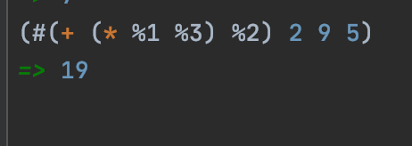

# 클로저 관련 메모들

## 세팅

1. 자바 런타임 설치.
2. `JDK(SE)` 설치
3. `brew install leiningen`
4. [_IntelliJ IDEA_](https://www.jetbrains.com/ko-kr/idea/) 설치
5. Cursive 플러그인 설치

## leiningen

```sh
lein new app tutorial # app 템플릿으로 tutorial 이란 이름의 프로젝트 생성
lein run # main 함수 실행
```

## 클로저

- 클로저는 Compiled language다.
  - 컴파일 되거나 interpret 되는 JAVA와는 달리 클로저는 오직 컴파일만 된다.
  - 컴파일러는 클로저 코드를 JVM 위에서 돌아가도록 JVM Byte code(.class)로 변환한다.
- 클로저는 One-pass compiler 이다.
  - 모드 함수들은 호출 되기전에 선언이 되어있어야만 한다.
- 클로저에서는 모든 것이 리스트다.
  - `(VERB PARAM1 PARAM2...)`
- 모든 것은 반환값을 갖는다.
  - 리턴 키워드가 별도로 없다.
  - 리스트의 최종 값이 반환값이 된다.
  - 
    - "hi"는 함수의 동작에 따른 출력물일 뿐으로, 실제 리턴값은 nil이다.
- `break` 연산자가 없다.
- Chaning Operations
  - 한 오퍼레이션의 결과가 다른 오퍼레이션의 인자가 된다.
  - 
```clojure
(println "ALICE HAS" (+ 2 3) "APPLES")
```
- 클로저는 코드 상단에서 선언되며, 클로저는 해당 네임스페이스의 스코프 안에서 함수나 변수를 식별한다.
    - 

## 함수에 대하여

- 클로저에서 모든 함수는 일급 객체이다.

### 간단한 함수의 예


### 익명함수



### 익명함수가 일급객체이기 때문에..

아래 코드의 실행결과는 15 출력 후 nil 반환.


### 명명된 함수 표현식과 활용


